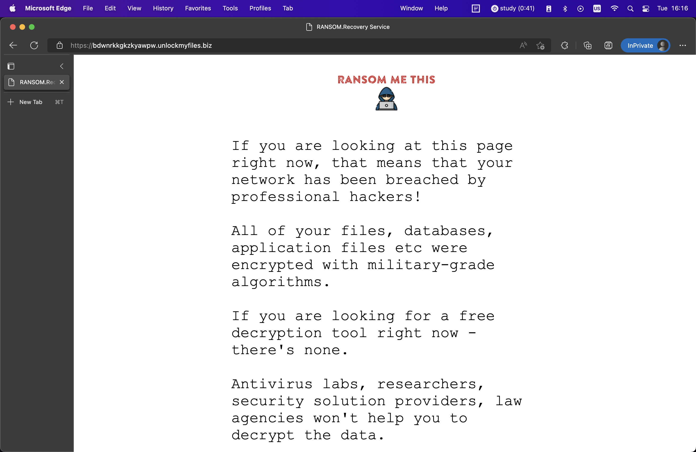
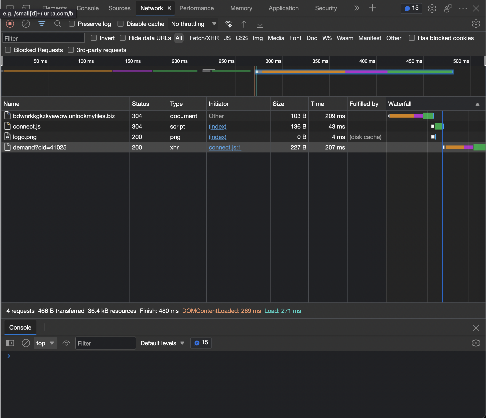
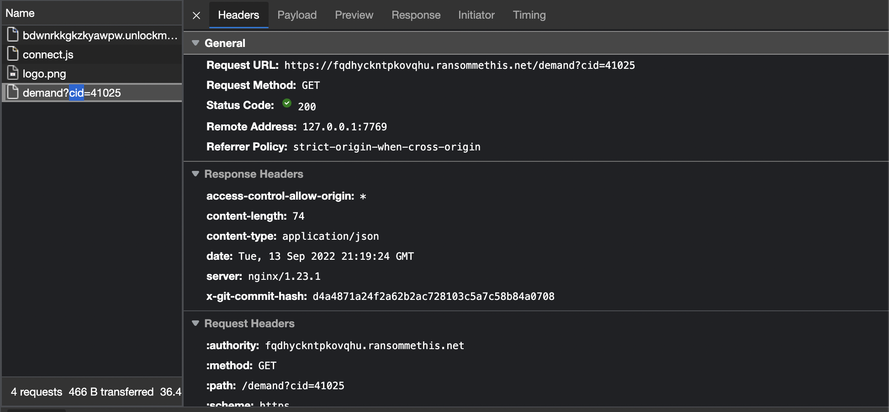
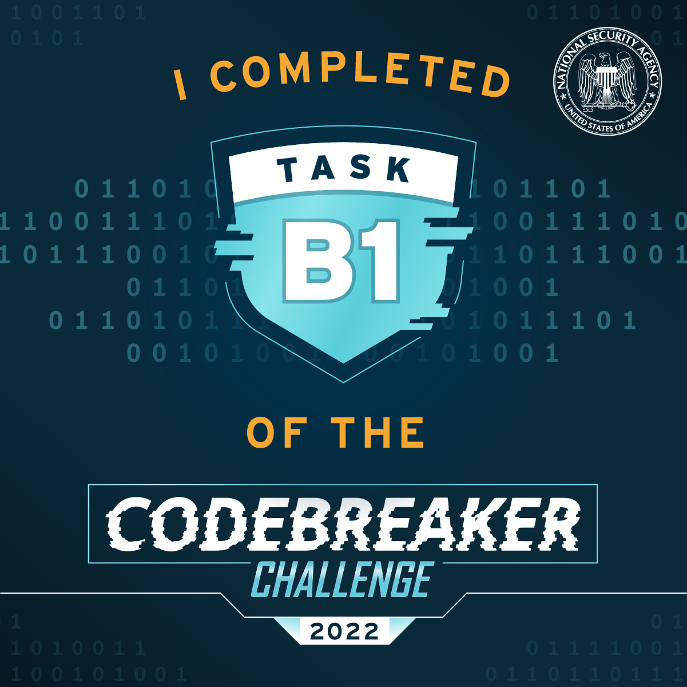

# Task B1 - Information Gathering - (Reverse Engineering, Web Analysis)Points: 10

## Problem statement

The attacker left a file with a ransom demand, which points to a site where they're demanding payment to release the victim's files.
We suspect that the attacker may not have been acting entirely on their own. There may be a connection between the attacker and a larger ransomware-as-a-service ring.
Analyze the demand site, and see if you can find a connection to another ransomware-related site.

## What to do

Enter the domain name of the associated site.

First, look at the content of the file.


```bash
%%bash
cat data/YOUR_FILES_ARE_SAFE.txt
```

    Your system has been breached by professional hackers.  Your files have been encrypted, but they are safe.
    Visit https://bdwnrkkgkzkyawpw.unlockmyfiles.biz/ to find out how to recover them.


Next, check what the site has using a browser.
I used MS Edge.

Here it looks like.


After reading through it, there seem no links. Use developer tools to dive deeper.
Type `F12` and go to `Network` tabs. You can see from where this page gets sources.



From this, I found a url that is different from <https://bdwnrkkgkzkyawpw.unlockmyfiles.biz/>.



The answer is <https://fqdhyckntpkovqhu.ransommethis.net/demand>


